# Radar Brasil G8

## Descrição do projeto

O **Radar Brasil G8** é uma aplicação web desenvolvida em React para o trabalho **T3: Atividade Prática - Projeto Integrador**, da disciplina de **Desenvolvimento Web Front-End**.

O sistema funciona como um painel de consultas de dados públicos do Brasil usando a **BrasilAPI**. Nele, o usuário consegue consultar estados, municípios, CEP, DDD e feriados nacionais de forma simples e organizada.

Além das consultas, a aplicação também mostra o **JSON formatado** retornado pelas requisições, salva um histórico local das pesquisas feitas e permite enviar um relatório por e-mail usando **EmailJS**.

## Tipo de aplicação

O Radar Brasil G8 foi desenvolvido como uma **SPA (Single Page Application)** em React.

Mesmo tendo várias rotas internas, como Dashboard, Estados, CEP, DDD, Feriados, Exportar e Sobre, a navegação acontece dentro da própria aplicação, sem recarregar uma nova página HTML a cada troca de tela.

As rotas foram organizadas com `react-router-dom`.

## Tema escolhido

**Dashboard de Dados Regionais com Exportação**

Escolhemos esse tema porque ele permite usar várias funcionalidades trabalhadas na disciplina em um único projeto, como consumo de API, componentes, estados, eventos, rotas, tratamento de erros, JSON formatado e envio de e-mail.

## Objetivo do sistema

O objetivo do sistema é facilitar consultas rápidas a dados públicos regionais.

A aplicação pode ser usada por estudantes, equipes acadêmicas, pesquisadores ou qualquer pessoa que precise consultar informações públicas de forma mais clara, sem acessar diretamente os endpoints da API.

## Funcionalidades principais

- Tela de login com autenticação simples.
- Redirecionamento após login.
- Rotas protegidas para acesso ao painel.
- Dashboard inicial com cards de navegação.
- Consulta de estados brasileiros.
- Consulta de municípios por UF.
- Busca local por nome de município.
- Consulta de endereço por CEP.
- Consulta de estado e cidades por DDD.
- Consulta de feriados nacionais por ano.
- Filtros e buscas locais nas páginas.
- Exibição do JSON formatado das requisições.
- Histórico local com até 10 consultas.
- Seleção de consultas para exportação.
- Envio manual de relatório por e-mail com EmailJS.
- Limite de até 5 consultas por envio de e-mail.
- Página 404 personalizada.
- Tratamento de erros de entrada e de requisição.
- Loaders durante consultas e envio.
- Layout responsivo com React-Bootstrap.

## Tecnologias utilizadas

- React
- Vite
- JavaScript
- Axios
- React-Bootstrap
- Bootstrap
- React Router DOM
- EmailJS
- React Icons
- React Spinners
- CSS

## APIs utilizadas

As consultas foram feitas usando endpoints da **BrasilAPI**:

- Estados: `/ibge/uf/v1`
- Municípios: `/ibge/municipios/v1/{uf}`
- CEP: `/cep/v2/{cep}`
- CEP fallback: `/cep/v1/{cep}`
- DDD: `/ddd/v1/{ddd}`
- Feriados nacionais: `/feriados/v1/{ano}`

## Como funciona a exportação por e-mail

A página **Exportar** reúne as consultas salvas no histórico e permite escolher quais resultados serão enviados por e-mail.

Para evitar excesso de dados no EmailJS, usamos algumas regras:

- O histórico local mantém até 10 consultas.
- O envio por e-mail permite até 5 consultas selecionadas por vez.
- Consultas grandes, como municípios, são enviadas com uma prévia reduzida.
- O JSON completo continua disponível na tela Exportar.
- O envio não é automático. Ele só acontece quando o usuário clica no botão de envio.

Essa regra ajuda a evitar erro por excesso de dados no serviço de e-mail.

## Pré-requisitos

Antes de executar o projeto, é necessário ter instalado:

- Node.js
- npm

## Como executar o projeto

1. Clone ou baixe este repositório.

2. Acesse a pasta do projeto:

```bash
cd radar-brasil-g8
```

3. Instale as dependências:

```bash
npm install
```

4. Inicie o servidor de desenvolvimento:

```bash
npm run dev
```

5. Acesse no navegador:

```bash
http://localhost:5173/
```

A porta pode mudar caso a `5173` já esteja em uso. Se isso acontecer, verifique a porta indicada no terminal.

## Configuração do EmailJS

Para o envio de e-mail funcionar, é necessário criar um arquivo `.env` na raiz do projeto.

Use o arquivo `.env.example` como modelo:

```env
VITE_EMAILJS_PUBLIC_KEY=sua_chave_aqui
VITE_EMAILJS_SERVICE_ID=seu_service_id_aqui
VITE_EMAILJS_EXPORT_TEMPLATE_ID=seu_template_id_aqui
VITE_EMAILJS_CONTACT_TEMPLATE_ID=seu_template_contato_aqui
```

O arquivo `.env` não deve ser enviado para o repositório, pois contém chaves reais. Ele está protegido pelo `.gitignore`.

## Acesso ao sistema

Para acessar o painel, utilize:

- Usuário: `G8`
- Senha: `2026`

## Estrutura geral do projeto

```txt
src/
├── components/
├── hooks/
├── pages/
├── services/
├── styles/
├── utils/
├── App.jsx
└── main.jsx
```

## Testes realizados

Durante o desenvolvimento, testamos os principais fluxos da aplicação:

- Login inválido.
- Login válido.
- Acesso a rotas protegidas.
- Logout.
- Consulta de estados.
- Filtro por região.
- Consulta de municípios por UF.
- Busca local por município.
- Consulta de CEP válido e inválido.
- Consulta de DDD válido e inválido.
- Consulta de feriados por ano.
- Tratamento de ano inválido.
- Exibição de JSON formatado.
- Histórico de consultas.
- Remoção individual de consulta.
- Limpeza do histórico.
- Exportação por e-mail.
- Limite de consultas no envio por e-mail.
- Página 404 personalizada.
- Build final do projeto.

## Prints do sistema

Abaixo estão alguns prints do sistema funcionando.

### 1. Tela de login

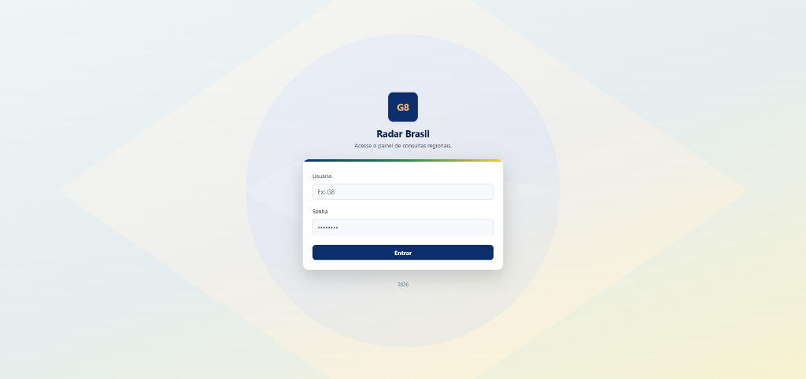

### 2. Dashboard principal

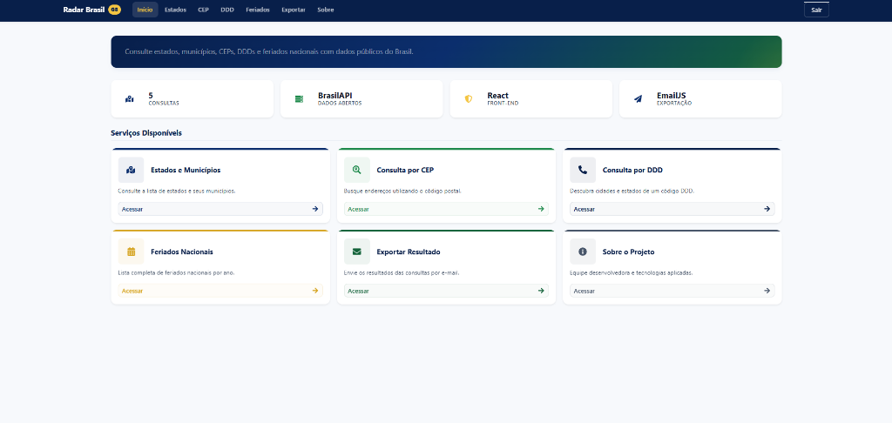

### 3. Consulta de estados

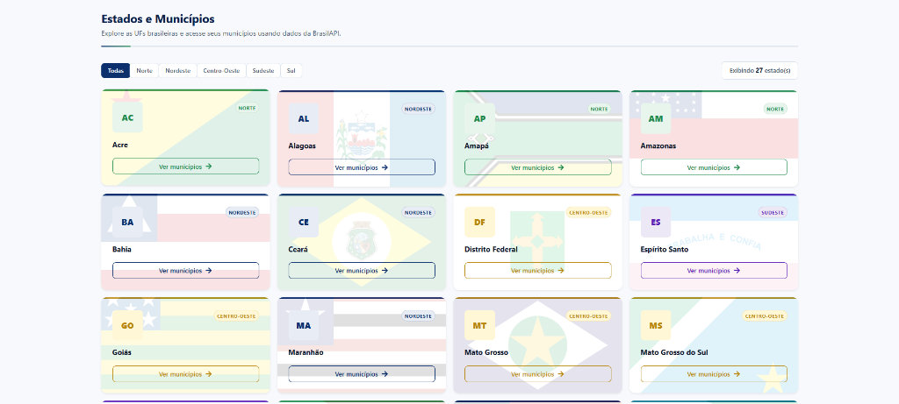

### 4. Municípios de Minas Gerais

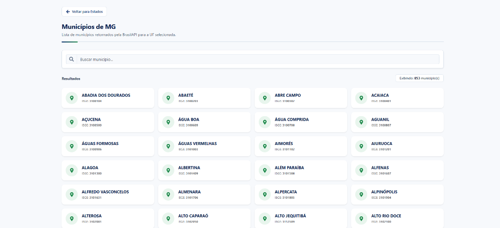

### 5. Busca local por município

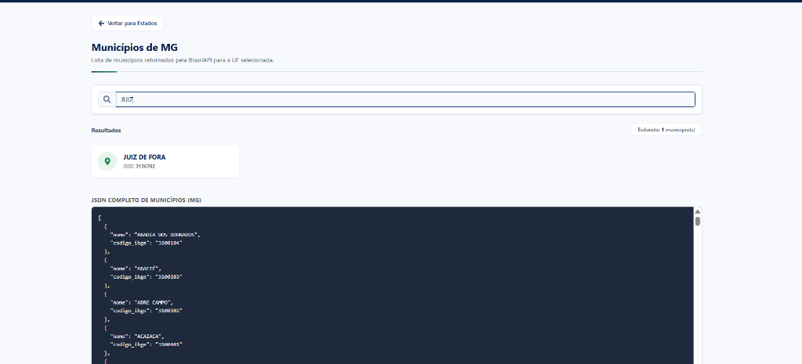

### 6. Consulta por CEP

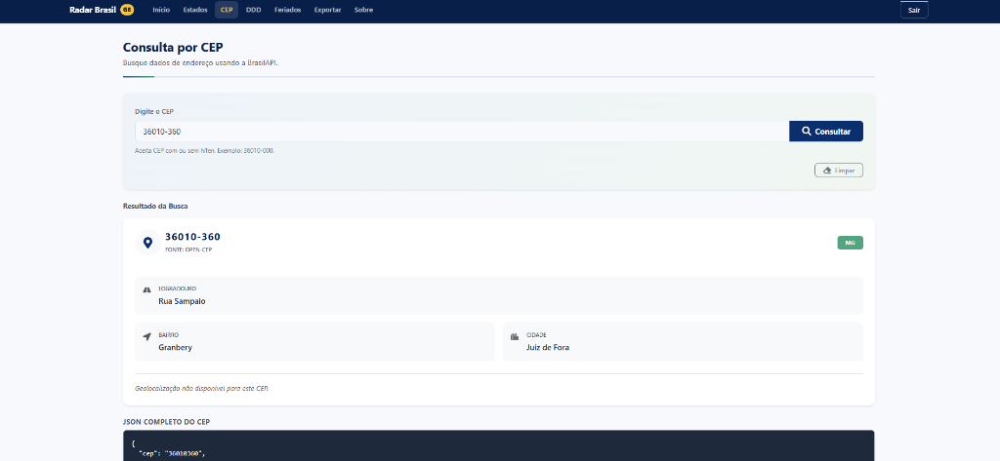

### 7. Consulta por DDD

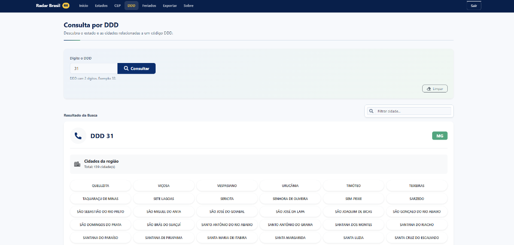

### 8. Consulta de feriados nacionais

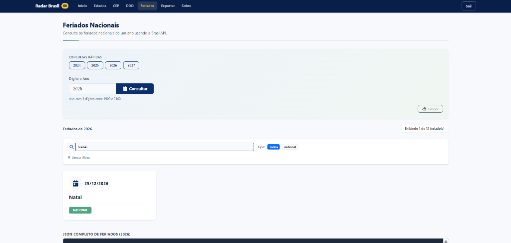

### 9. Exportação por e-mail

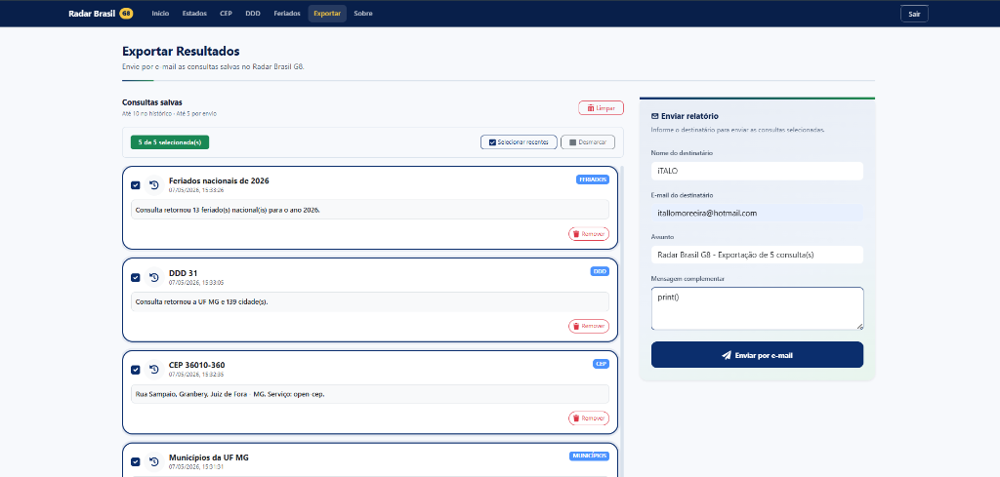

### 10. E-mail recebido

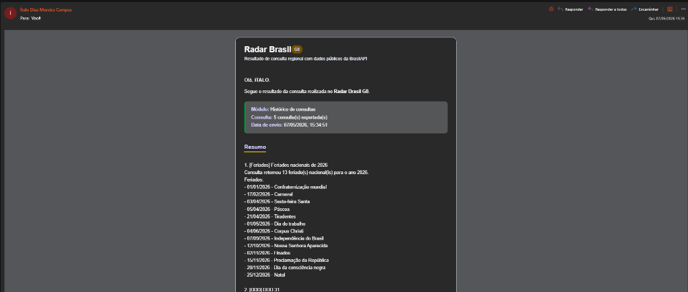

### 11. Página 404 personalizada

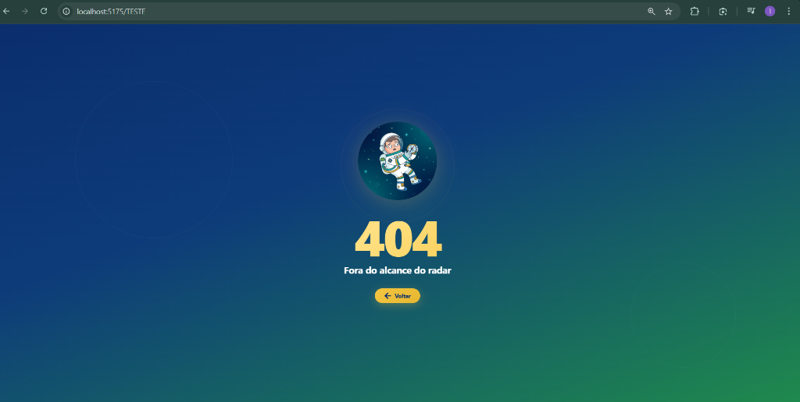

## Membros do grupo G8

- Gabriel Fagundes Motta
- Ítalo Dias Moreira Campos
- Julyanne Lauriano Genevain
- Rakel Garcia da Silva
- Raphaell Reiff Galoni

## Observação

Este projeto foi desenvolvido exclusivamente para fins acadêmicos, como parte da disciplina de **Desenvolvimento Web Front-End**.
